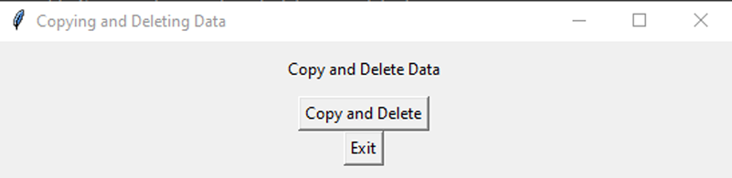

# 🚀 Copy and Delete Data 🚀

This Python application is a simple Tkinter program to copy specific lines from a text file and then delete those lines from the file. 
My personal use case is to automatically copy and delete a set of 5 lines containing account information from a text document and immediately post it as an ad. This way, I don't have to bother opening the text and dealing with it.

## Before Starting the Installation
- a. You need to specify which lines you want to copy from the txt file.

- b. You can provide the name of your txt file. It defaults to `main.txt.`

## Installation

- Download and install Python from [here](https://www.python.org/downloads/) 
- Open a terminal or command prompt in the project directory.
- Run the command `pip install -r requirements.txt` to install the necessary libraries.

## Usage

- After completing steps a and b, add data to your TXT file. Defaults to `main.txt`
- Run the `main.py` file to start the application.
- Click the `Copy and Delete` button to copy specific lines to the clipboard and delete them from the file. You can resize the application window as you wish.

## How to Create an Executable?

- You can check this [link](https://pypi.org/project/auto-py-to-exe/) 

## Contact
- Email: slapmemo@gmail.com
- Project Link: [GitHub](https://github.com/slapmemo/Copy-Delete-Data)
