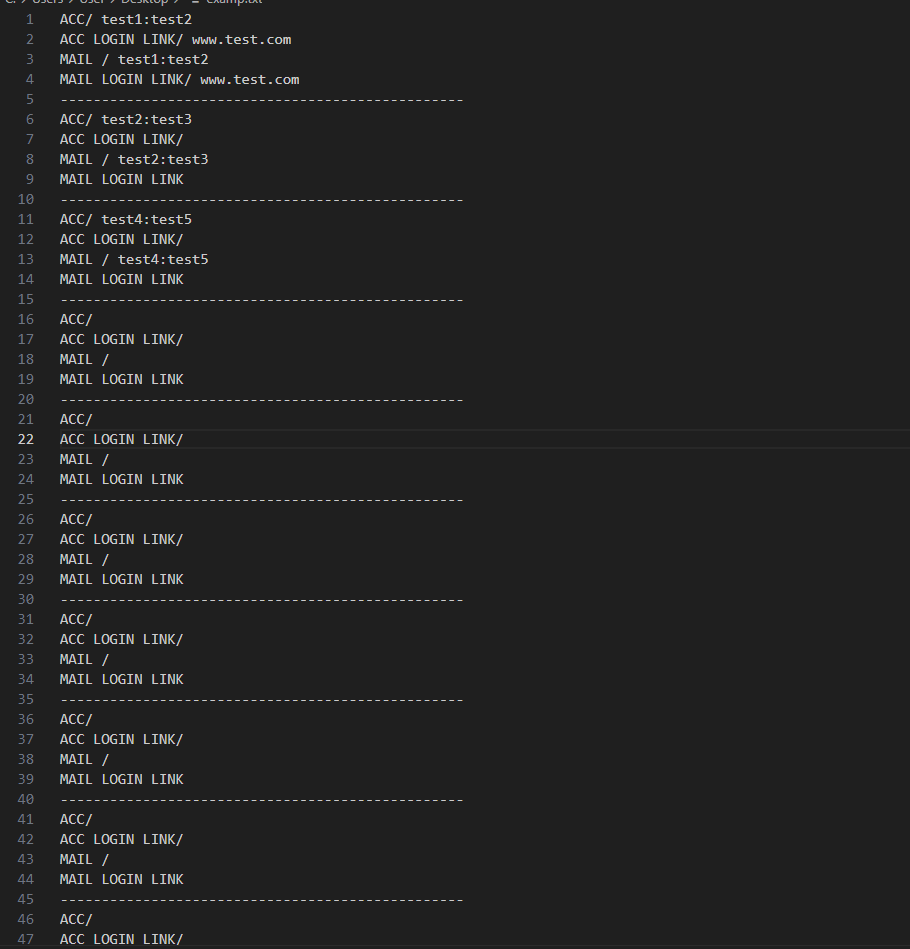
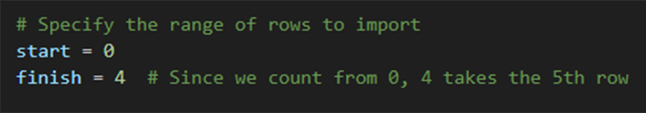
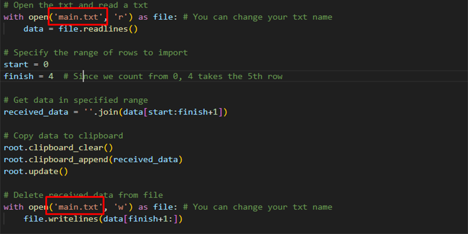

# 🚀 Veri Kopyalama ve Silme 🚀

Bu Python uygulaması, belirli bir metin dosyasındaki belirli satırları panoya kopyalamak ve ardından bu satırları dosyadan silmek için basit bir Tkinter uygulamasıdır.
Benim kişisel kullanma sebebim 5 satırlı bir hesap bilgilerinin olduğu text belgesinden otomatik kopyalayıp ve silip hemen ilana koymam. Bu sayede Text'i açıp uğraşmıyorum.

## Kuruluma başlamadan önce
- a. Kopyalayacağınız txt dosyasında kaçıncı satıra kadar kopyalayacağınızı belirtmeniz gerekir.

- b. Txt dosyanızının ismini yazabilirsiniz. Varsayılan olarak `main.txt` olarak yer alır.

## Kurulum

- Python'u [buradan](https://www.python.org/downloads/) indirip yükleyin.
- Proje dizininde terminal veya komut istemcisini açın.
- `pip install -r requirements.txt` komutunu çalıştırarak gerekli kütüphaneleri yükleyin.

## Kullanım

- a ve b işlemini yaptıktan sonra TXT'nize verileri ekleyin. Varsayılan olarak `main.txt`
- `main.py` dosyasını çalıştırarak uygulamayı başlatın.
- `Kopyala ve Sil` düğmesine tıklayarak belirli satırları panoya kopyalayın ve dosyadan silin. Uygulamanın boyutunu istediğiniz gibi büyütüp küçültebilirsiniz.

## Nasıl exe yapabilirim?

- Bu [linki](https://pypi.org/project/auto-py-to-exe/) inceleyebilirsiniz.

## İletişim 
- E-posta: slapmemo@gmail.com
- Proje Linki: [GitHub](https://github.com/kullanici/veri-kopyalama-ve-silme)